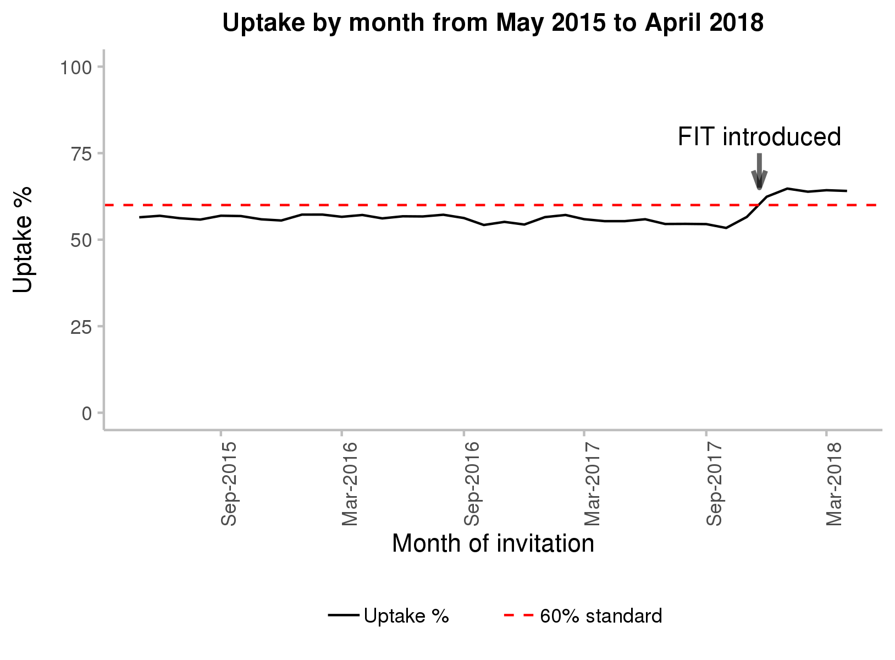

```{r, echo=FALSE, message=FALSE, warning=FALSE,error=FALSE}
## GC TO DO
# Center chart on output (currently a manual step, though not a major one)
# Reorder legend
# Possibly stretch out or center contact details

# Create chart in ggplot
library(dplyr)
library(tidyr)
library(zoo)
library(ggplot2)
library(scales)

# set filepaths and extract dates with script 0
source(here::here("code", "0_housekeeping.R"))

analysis_db <-
  readRDS(analysis_db_path) %>%
  filter(optin == 0 &
           hbr14 %in% 1:14 &
           invdate >= as.Date("2015-05-01") & 
           invdate <= as.Date("2018-04-30")) %>%
  select(invdate, invite_n, uptake_n) %>%
  mutate(
    yearmon = as.yearmon(invdate)
    )
# Summarise uptake by month
uptake_by_month <- analysis_db %>%
  group_by(yearmon) %>%
  summarise(uptake = sum(uptake_n)/sum(invite_n) * 100) %>%
  ungroup() %>%
  mutate(standard = 60) %>%
  gather("type", "value", uptake:standard) %>%
  mutate(type = forcats::fct_relevel(type, "uptake", "standard")) %>%
  arrange(yearmon, type)

# Create chart
chart <- ggplot(data = uptake_by_month, 
                 aes(x = as.Date(yearmon), 
                     y = value)) +
  geom_line(aes(linetype = type,
                colour = type)) +
  ylim(0,100) +
  scale_x_date(labels = date_format("%b-%Y"), 
               date_breaks = "6 months") +
  xlab("Month of invitation") + 
  ylab("Uptake %") +
  ggtitle("Uptake by month from May 2015 to April 2018") +
  scale_linetype_manual(values = c(1, 2),
                        labels = c("Uptake %", "60% standard")) +
  scale_colour_manual(values = c("black", "red"),
                      labels = c("Uptake %", "60% standard")) + 
  guides(guide_legend(reverse = TRUE)) + 
  annotate("text", 
           x = as.Date("2017-11-20"), 
           y = 80, 
           label = "FIT introduced") +
  annotate("segment", 
           x = as.Date("2017-11-20"), 
           xend = as.Date("2017-11-20"), 
           y = 75, 
           yend = 65, 
           colour = "black", 
           size = 1, 
           alpha = 0.6, 
           arrow = arrow(angle = 20, 
                         length = unit(0.11, "inches"),
                         ends = "last")) +
  theme(plot.title = element_text(hjust = 0.5, face = "bold", size = 11),
        panel.background = element_blank(),
        panel.grid.major = element_blank(),
        panel.grid.minor = element_blank(),
        axis.text.x = element_text(angle = 0, face = "bold"),
        axis.text.y = element_text(face = "bold"),
        axis.title.y = element_text(margin = margin(0,10,0,0)),
        axis.line = element_line(colour="grey"),
        axis.ticks = element_line(colour="grey"),
        legend.title = element_blank(),
        legend.key = element_blank(),
        legend.position = "right")

# Chart height decided by seeing what size of image would fit in word document
# and using right-click size to get the image size. Default in word is cm,
# ggsave takes inches (I'm sure there will be a conversion function in R?)
ggsave("chart1.png", plot = chart, device = "png", 
       dpi = 300, width = 6.1653543, height  = 2.582677)


#Create contact information
contact1 <- c("**Gavin Clark**", "Senior Information Analyst", "0131 275 7420", "gavin.clark2@nhs.net")
contact2 <- c("**Thomas Godfrey**", "Information Analyst", "0131 275 6692", "thomas.godfrey@nhs.net")

contact <- data.frame(contact1, contact2)
```

# Scottish Bowel Screening Programme 
# Statistics
## For invitations between 1 May 2016 and 
## 30 April 2018
#### A National Statistics publication for Scotland

#### Publication date: 5 February 2019
##### RESTRICTED STATISTICS: embargoed to 09:30 05/02/2019

### About this release

This release by Information Services Division (ISD) provides an update of the Scottish bowel screening statistics for the period 1st May 2016 to 30th April 2018 including uptake, laboratory workload and clinical outcomes. A new bowel screening test (the Faecal Immunochemical Test, or FIT) was launched on 20th of November 2017, replacing the Faecal Occult Blood Test (FOBT). The FIT requires participants to return just one bowel motion sample instead of the three samples previously required. The report contains comparisons of the new and old tests for uptake (the percentage of those invited who returned a completed test kit) and positivity (the percentage of completed kits that were positive). KPIs for the full 2-year period summarise data from both tests.

### Main Points

* 64% of people returned their test kit for FIT in the six months since the test was launched (Nov-17 to Apr-18). This is the first time the uptake has been better than the standard of 60%. This is in comparison to only 56% uptake for an earlier six month period for FOBT (Nov-16 to Apr-17).


<Div custom-style = "centre_justified">
 \ </div>


* The FIT also had a higher percentage of patients with a positive result than the FOBT (3.2% vs 2.1%)

* Ever since the bowel screening programme was launched, uptake has been lower in areas of higher deprivation. The gap between the lowest and highest areas of deprivation was smaller for FIT than for FOBT (20.7 vs 23.6 percentage points).

Looking over the full 2-year period, combining  data for both the old and the new test: 

* Of those with a positive test result, 6.1% had a bowel cancer and 41.2% had an adenoma (a benign growth that may develop into cancer in the future).

* Three out of five screen detected cancers (62.1%) were diagnosed at the earliest two stages, consistent with previous reporting periods. The earlier a cancer is detected the greater the chances are of successful treatment.


### Background

The Scottish Bowel Screening Programme started a phased roll-out in June 2007. By December 2009, all NHS Boards in Scotland were participating in the Programme. Trend charts show data by 2-year intervals from 1st May to 30th April e.g. 2007/09 covers 1st May 2007 to 30th April 2009.
This publication relates to men and women registered with a Community Health Index number aged between 50-74 years who are invited to participate and to be screened every two years. Eligible people are posted a screening kit which is completed at home. The kit is then returned to the central screening centre in Dundee and tested for hidden traces of blood in the stool. Since 1st April 2013, those aged over 74 can self-refer and opt into bowel screening.
A new bowel cancer test which simplifies the sample collection process has been introduced with an aim to increase participation in Scotland’s bowel screening programme. Further information is available from [Cancer Research UK](https://www.cancerresearchuk.org/health-professional/screening/bowel-screening-evidence-and-resources/faecal-immunochemical-test-fit).


### Contact

```{r, echo = FALSE}
    knitr::kable(contact, col.names=NULL)
```

### Further Information

The [Bowel Screening Programme Key Performance Indicators report](http://www.isdscotland.org/Health-Topics/Cancer/Publications/2019-02-05/2019-02-05-Bowel-Screening-KPI-Report.xlsx), which includes a series of measures used to monitor and evaluate the Scottish Bowel Screening Programme, is available on the ISD website. You can find more information on Detect Cancer Early (DCE) on the [ISD's DCE pages](http://www.isdscotland.org/Health-Topics/Cancer/Detect-Cancer-Early/). For related topics, please see [the Cancer pages](http://www.isdscotland.org/Health-Topics/Cancer/) on the ISD website. The next release of this publication will be August 2019.

